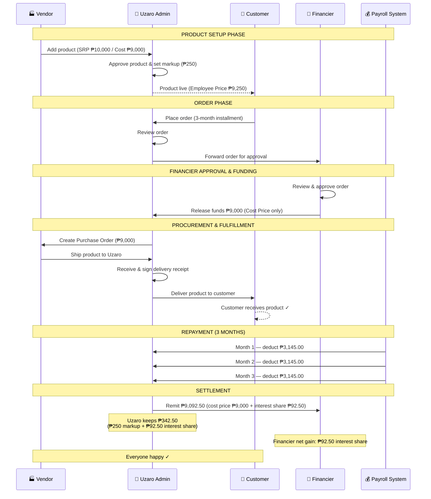
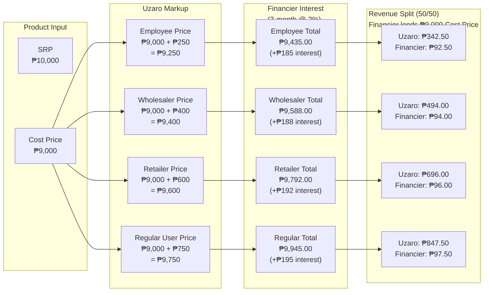
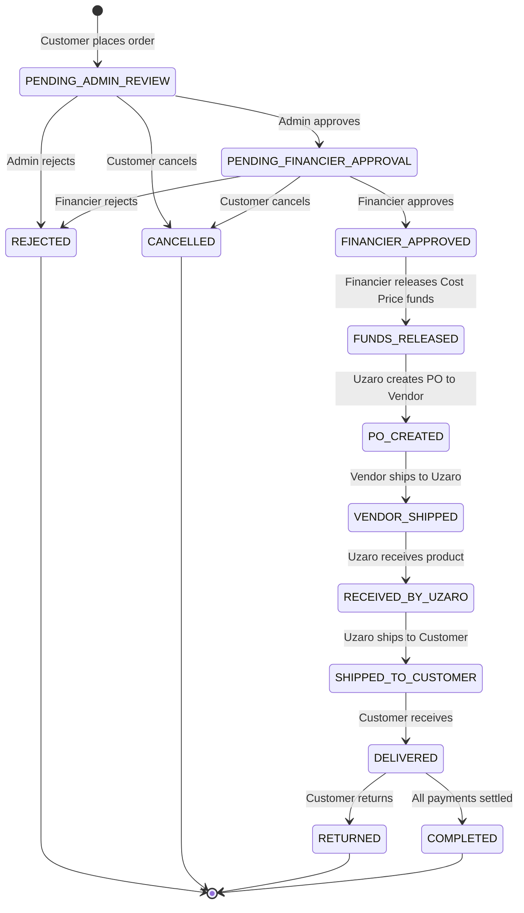

# EPP Flowcharts

## 1. Happy Path - End-to-End Order Flow (Installment)

```mermaid
---
config:
  layout: elk
---
flowchart TB
 subgraph VENDOR["🏭 VENDOR / SUPPLIER"]
        V1["Vendor adds product to EPP"]
        V2["Set SRP = ₱10,000"]
        V3["Set Cost Price = ₱9,000\n— discounted via partnership —"]
  end
 subgraph ADMIN["🏢 UZARO ADMIN"]
        A1["Review & approve product listing"]
        A2["Set markup per customer type\nEmployee Markup = ₱250"]
        A3["Product goes live\nEmployee Price = ₱9,250"]
  end
 subgraph CUSTOMER["👤 CUSTOMER — Employee"]
        C1["Browse products on EPP app"]
        C2["Select product\nSees Employee Price = ₱9,250"]
        C3["Choose installment payment\n3 months"]
        C4["Place order"]
  end
 subgraph PRICING["💰 PRICING CALCULATION"]
        P1["Base Price = ₱9,250 (Employee Price)"]
        P2["Principal per Installment\n₱9,250 ÷ 3 = ₱3,083.33"]
        P3["Interest per Installment\n₱3,083.33 × 2% = ₱61.67"]
        P4["Amount per Installment\n₱3,083.33 + ₱61.67 = ₱3,145.00"]
        P5["Total Price\n₱3,145.00 × 3 = ₱9,435.00"]
        P6["Total Interest = ₱185.00"]
  end
 subgraph APPROVAL["✅ ORDER APPROVAL"]
        AP1["Uzaro Admin reviews order"]
        AP2["Financier reviews order"]
        AP3["Financier approves order"]
  end
 subgraph FINANCIER["🏦 FINANCIER"]
        F1["Release funds = Cost Price\n₱9,000 to Uzaro\n(excludes Uzaro markup)"]
  end
 subgraph PROCUREMENT["📦 PROCUREMENT & FULFILLMENT"]
        PR1["Uzaro creates Purchase Order\nto Vendor for ₱9,000"]
        PR2["Vendor fulfills & ships\nproduct to Uzaro"]
        PR3["Uzaro receives product\n& signs delivery receipt"]
        PR4["Uzaro ships product\nto Customer"]
        PR5["Customer receives product ✓"]
  end
 subgraph REPAYMENT["💸 REPAYMENT CYCLE"]
        R1["Month 1: Payroll deducts ₱3,145.00"]
        R2["Month 2: Payroll deducts ₱3,145.00"]
        R3["Month 3: Payroll deducts ₱3,145.00"]
        R4["Total collected = ₱9,435.00"]
  end
 subgraph SETTLEMENT["🤝 SETTLEMENT & REVENUE SPLIT"]
        S1["Uzaro remits to Financier:\n₱9,000 cost price + ₱92.50 interest share\n= ₱9,092.50"]
        S2["Uzaro retains:\n₱250 markup + ₱92.50 interest share\n= ₱342.50"]
        S3["Financier happy ✓\nUzaro happy ✓\nCustomer happy ✓"]
  end
    V1 --> V2
    V2 --> V3
    A1 --> A2
    A2 --> A3
    C1 --> C2
    C2 --> C3
    C3 --> C4
    P1 --> P2
    P2 --> P3
    P3 --> P4
    P4 --> P5
    P5 --> P6
    AP1 --> AP2
    AP2 --> AP3
    PR1 --> PR2
    PR2 --> PR3
    PR3 --> PR4
    PR4 --> PR5
    R1 --> R2
    R2 --> R3
    R3 --> R4
    S1 --> S3
    S2 --> S3
    V3 --> A1
    A3 --> C1
    C4 --> P1
    P6 --> AP1
    AP3 --> F1
    F1 --> PR1
    PR5 --> R1
    R4 --> S1 & S2
```

## 2. Simplified Role Swimlane Diagram

```mermaid
sequenceDiagram
    participant V as 🏭 Vendor
    participant A as 🏢 Uzaro Admin
    participant C as 👤 Customer
    participant F as 🏦 Financier
    participant P as 💰 Payroll System

    Note over V,P: PRODUCT SETUP PHASE
    V->>A: Add product (SRP ₱10,000 / Cost ₱9,000)
    A->>A: Approve product & set markup (₱250)
    A-->>C: Product live (Employee Price ₱9,250)

    Note over V,P: ORDER PHASE
    C->>A: Place order (3-month installment)
    A->>A: Review order
    A->>F: Forward order for approval

    Note over V,P: FINANCIER APPROVAL & FUNDING
    F->>F: Review & approve order
    F->>A: Release funds ₱9,000 (Cost Price only)

    Note over V,P: PROCUREMENT & FULFILLMENT
    A->>V: Create Purchase Order (₱9,000)
    V->>A: Ship product to Uzaro
    A->>A: Receive & sign delivery receipt
    A->>C: Deliver product to customer
    C-->>C: Customer receives product ✓

    Note over V,P: REPAYMENT (3 MONTHS)
    P->>A: Month 1 — deduct ₱3,145.00
    P->>A: Month 2 — deduct ₱3,145.00
    P->>A: Month 3 — deduct ₱3,145.00

    Note over V,P: SETTLEMENT
    A->>F: Remit ₱9,092.50 (cost price ₱9,000 + interest share ₱92.50)
    Note over A: Uzaro keeps ₱342.50<br/>(₱250 markup + ₱92.50 interest share)
    Note over F: Financier net gain: ₱92.50 interest share
    Note over V,C: Everyone happy ✓
```

## 3. Pricing Breakdown Diagram

```mermaid
flowchart LR
    subgraph INPUT["Product Input"]
        SRP["SRP\n₱10,000"]
        CP["Cost Price\n₱9,000"]
    end

    subgraph MARKUP["Uzaro Markup"]
        EP["Employee Price\n₱9,000 + ₱250\n= ₱9,250"]
        WP["Wholesaler Price\n₱9,000 + ₱400\n= ₱9,400"]
        RP["Retailer Price\n₱9,000 + ₱600\n= ₱9,600"]
        UP["Regular User Price\n₱9,000 + ₱750\n= ₱9,750"]
    end

    subgraph INSTALLMENT["Financier Interest\n(3-month @ 2%)"]
        EI["Employee Total\n₱9,435.00\n(+₱185 interest)"]
        WI["Wholesaler Total\n₱9,588.00\n(+₱188 interest)"]
        RI["Retailer Total\n₱9,792.00\n(+₱192 interest)"]
        UI["Regular Total\n₱9,945.00\n(+₱195 interest)"]
    end

    subgraph SPLIT["Revenue Split (50/50)\nFinancier lends ₱9,000 Cost Price"]
        ES["Uzaro: ₱342.50\nFinancier: ₱92.50"]
        WS["Uzaro: ₱494.00\nFinancier: ₱94.00"]
        RS["Uzaro: ₱696.00\nFinancier: ₱96.00"]
        US["Uzaro: ₱847.50\nFinancier: ₱97.50"]
    end

    CP --> EP --> EI --> ES
    CP --> WP --> WI --> WS
    CP --> RP --> RI --> RS
    CP --> UP --> UI --> US
```

## 4. Order Status State Diagram

```mermaid
stateDiagram-v2
    [*] --> PENDING_ADMIN_REVIEW: Customer places order

    PENDING_ADMIN_REVIEW --> PENDING_FINANCIER_APPROVAL: Admin approves
    PENDING_ADMIN_REVIEW --> REJECTED: Admin rejects

    PENDING_FINANCIER_APPROVAL --> FINANCIER_APPROVED: Financier approves
    PENDING_FINANCIER_APPROVAL --> REJECTED: Financier rejects

    FINANCIER_APPROVED --> FUNDS_RELEASED: Financier releases Cost Price funds

    FUNDS_RELEASED --> PO_CREATED: Uzaro creates PO to Vendor

    PO_CREATED --> VENDOR_SHIPPED: Vendor ships to Uzaro

    VENDOR_SHIPPED --> RECEIVED_BY_UZARO: Uzaro receives product

    RECEIVED_BY_UZARO --> SHIPPED_TO_CUSTOMER: Uzaro ships to Customer

    SHIPPED_TO_CUSTOMER --> DELIVERED: Customer receives

    DELIVERED --> COMPLETED: All payments settled

    PENDING_ADMIN_REVIEW --> CANCELLED: Customer cancels
    PENDING_FINANCIER_APPROVAL --> CANCELLED: Customer cancels
    DELIVERED --> RETURNED: Customer returns

    REJECTED --> [*]
    CANCELLED --> [*]
    RETURNED --> [*]
    COMPLETED --> [*]
```
